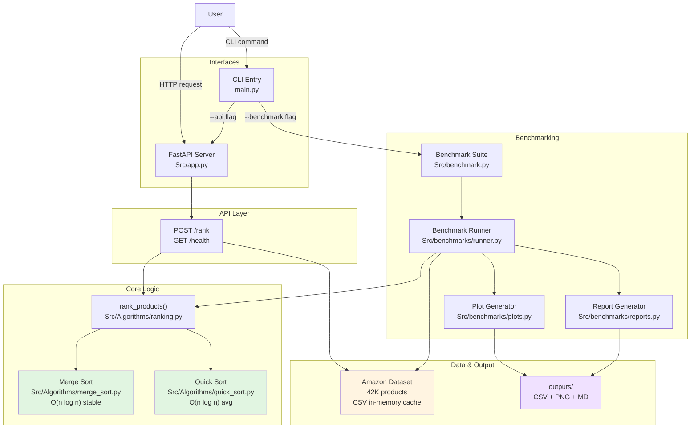

# E-Commerce Product Ranking: Proof of Concept

## Overview

This project implements a simple proof-of-concept for ranking Amazon products from a 42K dataset using Merge Sort and Quick Sort algorithms.

**Two core components:**

1. **HTTP API**: `POST /rank` endpoint that ranks products by strategy and returns Top-K IDs with timing
2. **Benchmarking**: Performance testing across dataset sizes {1K, 5K, 10K, 42K} and k values {10, 100}

## Objectives

1. Implement deterministic product ranking using sorting algorithms
2. Compare Merge Sort vs Quick Sort runtime across dataset sizes
3. Provide REST API for on-demand ranking requests
4. Generate performance reports and visualizations

## Core Implementation

### Architecture

**System Overview:**



**Component Details:**

| Component | Role | Input | Output |
|-----------|------|-------|--------|
| **Ranking API** | FastAPI server with REST endpoints | JSON request body | JSON response with ranked IDs and timing |
| **Ranking Function** | Orchestrates sorting and filtering | Products list, strategy, algorithm, k | Top-k product IDs, elapsed time |
| **Merge Sort** | Stable O(n log n) sorting | Array of tuples, key function | Sorted array |
| **Quick Sort** | In-place O(n log n) avg sorting | Array of tuples, pivot strategy | Sorted array |
| **Benchmark Runner** | Executes all test configurations | Dataset, sizes, k values, strategies | Raw timing results (CSV) |
| **Plot Generator** | Creates performance visualizations | Benchmark results | PNG charts |
| **Report Generator** | Generates markdown summary | Benchmark results | Markdown report |

### Component A: Ranking API

**Endpoint:** `POST /rank`

**Request:**

```json
{
  "strategy": "price_desc",
  "algorithm": "merge_sort",
  "k": 10
}
```

**Response:**

```json
{
  "ranked_ids": ["prod_0", "prod_5", ...],
  "elapsed_time_ms": 12.45,
  "count": 10
}
```

**Strategies:**

- `price_asc`: Sort by discounted price (ascending)
- `price_desc`: Sort by discounted price (descending)
- `rating_asc`: Sort by product rating (ascending)
- `rating_desc`: Sort by product rating (descending)

**Algorithms:**

- `merge_sort`: Stable, $O(n \log n)$ time
- `quick_sort`: Average $O(n \log n)$ time

**Key Features:**

- In-memory caching of dataset
- Deterministic ranking order
- Input validation
- Millisecond-precision timing

Health check: `GET /health` → `{"status": "ok"}`

### Component B: Benchmarking

Benchmarks test algorithm performance across:

- **Dataset sizes:** 1K, 5K, 10K, 42K products
- **k values:** 10, 100
- **Strategies:** price_desc, rating_desc
- **Algorithms:** merge_sort, quick_sort

**3 runs per configuration** with average and std dev computed.

**Outputs:**

- `outputs/benchmarks/benchmark_results.csv`: Raw timing data
- `outputs/reports/benchmark_report.md`: Summary statistics  
- `outputs/reports/runtime_scaling.png`: Time vs dataset size
- `outputs/reports/algorithm_comparison.png`: Algorithm comparison chart

## Scope

- FastAPI server with `/rank` and `/health` endpoints  
- Merge Sort and Quick Sort algorithms with stable/avg $O(n \log n)$ complexity
- Single-attribute ranking by price or rating (ascending/descending)
- Benchmark suite: 4 dataset sizes × 2 k values × 2 strategies × 2 algorithms = 32 configurations
- Performance metrics: CSV results, timing statistics, runtime plots
- Dataset caching for query efficiency

## Dataset

**Amazon Products Sales (42K products, 2025)**

- **Source:** [Kaggle](https://www.kaggle.com/datasets/ikramshah512/amazon-products-sales-dataset-42k-items-2025)
- **License:** CC BY-NC 4.0 (non-commercial research)
- **Location:** `Dataset/amazon_products_sales_data/amazon_products_sales_data_cleaned.csv`
- **Size:** 42,675 rows × 17 columns
- **Primary ranking attributes:**
  - `discounted_price`: Current product price
  - `product_rating`: Average customer rating (0.0 to 5.0)
- **Additional attributes:** `product_title`, `total_reviews`, `product_category`, `discount_percentage`, `original_price`, etc.

**Data preparation:**

- Product IDs auto-generated as `prod_0`, `prod_1`, ... if not in source
- Missing values in numeric columns are handled with safe defaults (0.0)
- Data loaded once per API session and cached in-memory

## Algorithms

**Ranking Determinism:**

Each strategy produces a deterministic, globally-consistent ranking order:

1. **Primary sort key:** Selected strategy value (price or rating)
2. **Tie-breaking:** Floating-point tolerance $|a-b| \le 1e^{-9}$
3. **Return:** Top-k products as list of product IDs, in sorted order

**Time Complexity:**

- **Merge Sort:** Stable, $O(n \log n)$ time, $O(n)$ space
- **Quick Sort:** In-place, average $O(n \log n)$, worst $O(n^2)$ (rare with random pivot)

Both algorithms are implemented as recursive functions and accept custom key extractors.

## References

- [project.md](project.md): Technical specification and detailed design
- [dataset.md](dataset.md): Dataset schema and column mapping
- [links.md](links.md): External links and data sources

## Quick Start

### 1. Install Dependencies

```bash
uv sync
```

### 2. Run Benchmarks

**Smoke run** (1K & 5K products only, fastest):

```bash
uv run python main.py benchmark --smoke
```

**Full run** (all dataset sizes 1K, 5K, 10K, 42K):

```bash
uv run python main.py benchmark --full
```

Reports and data saved to `outputs/benchmarks/` and `outputs/reports/`.

### 3. Start API Server

```bash
uv run python main.py api --host 0.0.0.0 --port 5000
```

Server runs at `http://localhost:5000`

**Health check:**

```bash
curl http://localhost:5000/health
```

**Example ranking request:**

```bash
curl -X POST http://localhost:5000/rank \
  -H "Content-Type: application/json" \
  -d '{"strategy": "price_desc", "algorithm": "merge_sort", "k": 10}'
```
